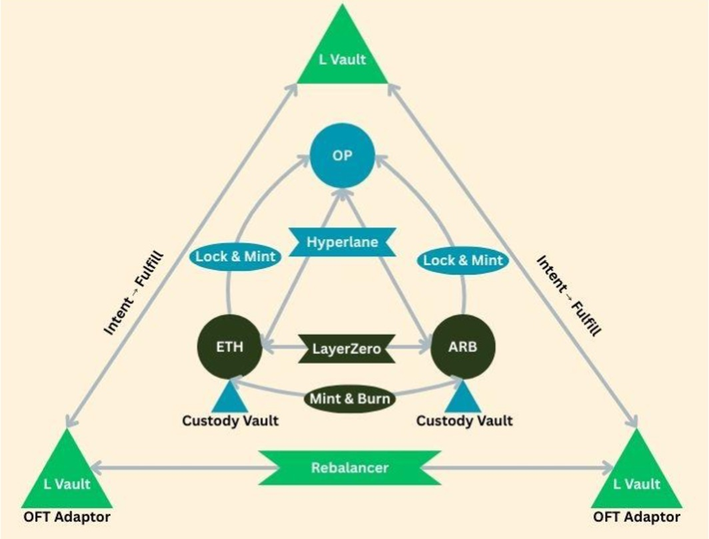

# HyperPay: Intent-Driven PyUSD Bridging

## Product Overview

With HyperPay, no matter where your PyUSD lives, declare the outcome and it will fulfill it.

Driven by a composable intent engine over Hyperlane Warp Routes 2.0 + LayerZero OFT, HyperPay lets you bring PyUSD to additional chains and connects your chain with a unified messaging layer, bridges and intents.

### Key Features

- **Unified Routing**: Automatically selects and lets you interact with the optimal path between Hyperlane Warp Routes 2.0 and LayerZero OFT
- **Fast Intent Path**: Declare an intent; solvers fulfill it on-chain. Approve-then-call is handled under the hood for a single-confirm flow that settles in seconds—an almost-instant transfer experience
- **Composable Infrastructure**: Each component can be deployed independently to bring messaging, bridging, or intent capabilities to any new chain
- **Modular by Design**: Mix and match components without vendor lock-in - use just the messaging layer, add HWR routes, or deploy the full intent stack
- **ERC-7683 Compliance**: Follows the Open Intents Framework standard for cross-chain intent execution and settlement

## System Architecture



HyperPay creates a unified bridging experience by combining Hyperlane Warp Routes 2.0 and LayerZero OFT technologies:

### Core Architecture Components

- **L Vault (Liquidity Vault)**: Central liquidity management on Optimism - *deployable to any chain as a liquidity hub*
- **Hyperlane Messaging Layer**: Secure cross-chain communication infrastructure - *spin up on any new chain to enable messaging*
- **Hyperlane Lock & Mint**: Connects Ethereum and Arbitrum to Optimism via collateral locking and synthetic minting - *modular warp routes deployable to any chain pair*
- **LayerZero OFT Integration**: Direct ETH ↔ ARB transfers using OFT standard - *composable with any LayerZero-supported chain*
- **Custody Vaults**: Secure token storage infrastructure - *reusable vault contracts for any token/chain*
- **OFT Adapters**: LayerZero integration points - *modular adapters for cross-chain transfers*
- **Rebalancer**: Automated liquidity management - *composable rebalancing logic for any vault setup*
- **Intent Infrastructure**: Solver-driven execution framework - *deployable intent stack for any chain ecosystem*

### Unified Bridging Flow

1. **Intent Declaration**: Users declare desired outcomes (amount, destination, recipient)
2. **Route Detection**: System automatically selects optimal path (Hyperlane vs LayerZero)
3. **Solver Fulfillment**: Decentralized solvers compete to fulfill intents optimally
4. **Cross-Chain Settlement**: Hyperlane oracles verify and settle transactions
5. **Token Delivery**: Recipients receive tokens on destination chain in seconds

## Modular & Composable Architecture

HyperPay is built as a **composable infrastructure stack** where each component can be deployed independently or combined to create custom bridging solutions. The four main packages are designed for maximum reusability across different chains and use cases:

```
┌─────────────────┐    ┌─────────────────┐    ┌─────────────────┐
│   bridge-ui     │    │  intents-stack  │    │ hyperlane-pkg   │
│  (Frontend UI)  │    │ (Intent Infra)  │    │ (Messaging Infra)│
├─────────────────┤    ├─────────────────┤    ├─────────────────┤
│ • Route Detection│    │ • OIF Solver    │    │ • Hyperlane     │
│ • Intent Submit │    │ • Settlement    │    │   Messaging     │
│ • Registry Mgmt │    │ • ERC-7683      │    │ • Warp Routes   │
│ • Multi-Bridge  │    │ • Modular Stack │    │ • Agents/Relayer│
│   Support       │    │ • Pluggable     │    │ • New Chain     │
│                 │    │   Backends      │    │   Onboarding    │
└─────────────────┘    └─────────────────┘    └─────────────────┘
         │                       │                       │
         └───────────────────────┼───────────────────────┘
                                 │
                    ┌─────────────────┐
                    │ hyperlane-tools │
                    │ (Deploy Tools)  │
                    ├─────────────────┤
                    │ • Registry Build│
                    │ • HWR Deploy    │
                    │ • Chain Setup   │
                    │ • Artifacts     │
                    └─────────────────┘

🔧 COMPOSABLE: Each package can be used independently
🚀 REUSABLE: Deploy messaging/bridging/intents to any new chain
🔌 PLUGGABLE: Mix and match components for custom solutions
```

### Modular Deployment Patterns

**🌐 Bring Messaging to New Chains**
- Deploy `hyperlane-package` alone to add secure cross-chain messaging to any new chain
- Spin up validators, relayers, and mailbox contracts with one-click Kurtosis deployment
- Instantly connect new chains to the Hyperlane network

**🌉 Add Bridging Infrastructure**
- Use `hyperlane-tools` to deploy HWR 2.0 warp routes between any chain pairs
- Configure multi-collateral to synthetic topologies for any token
- Reuse existing messaging infrastructure or deploy fresh

**⚡ Deploy Intent Infrastructure**
- Spin up `intents-stack` on any chain to enable solver-driven intent execution
- Modular settlement backends: plug in Hyperlane, Wormhole, or custom oracles
- ERC-7683 compliant contracts work with any intent ecosystem

**🎯 Complete Bridging Solution**
- Combine all packages for full-featured intent-driven bridging
- `bridge-ui` provides unified interface across all deployed infrastructure
- Registry system automatically discovers and routes across available bridges

### Component Interactions & Reusability

1. **Messaging Layer**: `hyperlane-package` provides reusable cross-chain messaging for any application
2. **Bridge Infrastructure**: `hyperlane-tools` deploys composable warp routes that work with any messaging layer
3. **Intent Execution**: `intents-stack` creates pluggable solver infrastructure that works with any settlement backend
4. **Unified Interface**: `bridge-ui` provides composable frontend that can route across any deployed bridges

## Component Deep Dive

### 1. Bridge UI (Composable Frontend)

**Reusable Interface Layer**: The bridge UI is designed as a composable frontend that can work with any combination of deployed bridge infrastructure. It automatically discovers available routes and provides a unified interface regardless of the underlying bridge technology.

**Multi-Bridge Support**: Seamlessly routes between Hyperlane Warp Routes 2.0, LayerZero OFT, and any other bridges added to the registry system.

**Key Files:**
- `src/lib/routeDetector.ts` - Intelligent route detection logic
- `src/lib/fastIntent.ts` - ERC-7683 intent submission implementation
- `src/components/BridgeSelector.tsx` - Main bridge interface component
- `public/registry.artifact.json` - Route registry configuration

**Route Detection Logic:**
```typescript
// Automatically detects optimal path between HWR and OFT
export function detectRoute(reg: UnifiedRegistry, input: DetectionInput): DetectionResult {
  // 1. Check for HWR routes with direct path
  // 2. Fallback to OFT if both chains supported
  // 3. Return appropriate bridge type or error
}
```

**Fast Intent Flow:**
1. User selects origin/destination chains and amount
2. Route detector determines optimal bridge (HWR vs OFT)
3. For fast transfers, intent is encoded using ERC-7683 standard
4. Intent submitted to input settler contract
5. Solvers monitor and fulfill intent on destination chain

### 2. Intents Stack (Modular Intent Infrastructure)

**Composable Intent Framework**: Built on the Open Intents Framework, this package provides **modular intent infrastructure** that can be deployed to any chain ecosystem. Each component is designed for maximum reusability and composability.

**Pluggable Architecture**: The intent stack is designed with pluggable backends - you can mix and match settlement layers (Hyperlane, Wormhole, custom), storage backends (file, memory, database), and solver strategies based on your specific needs.

**Independent Deployment**: Deploy just the solver infrastructure to add intent capabilities to existing bridges, or combine with messaging and bridge packages for a complete solution.

**Key Files:**
- `main.star` - Main orchestration entry point
- `modules/solver.star` - Solver service configuration and deployment
- `modules/settlement/hyperlane.star` - Hyperlane settlement backend
- `modules/contracts.star` - Smart contract deployment module

**Orchestration Flow:**
```python
def run(plan, args):
    # Phase 1: Deploy or import smart contracts
    addresses = contracts_module.deploy_or_import(plan, args)
    
    # Phase 2: Configure settlement layer (Hyperlane oracles)
    settlement_config = settlement_module.build_oracle_mapping(plan, args, addresses)
    
    # Phase 3: Launch solver service
    solver_info = solver_module.launch(plan, args, addresses, settlement_config)
    
    # Phase 4: Launch API documentation
    specs_info = specs_module.launch(plan, args, solver_info)
```

**Modular Settlement Backends:**
- **Hyperlane Backend**: Plug into existing Hyperlane messaging infrastructure
- **Custom Backends**: Bring your own oracle system or settlement layer
- **Wormhole Support**: Easy integration with Wormhole messaging (configurable)
- **Multi-Backend**: Run multiple settlement backends simultaneously

**Composable Solver Infrastructure:**
- **Rust Microservice**: Containerized solver that can run anywhere
- **Pluggable Storage**: File, memory, database, or custom storage backends
- **Modular Discovery**: Monitor any EVM chain or custom event sources
- **RESTful API**: Standard interface that works with any frontend

**Reusable Components:**
- **Contract Templates**: ERC-7683 compliant contracts deployable to any EVM chain
- **Configuration Generator**: Dynamic config generation for any chain setup
- **Monitoring Stack**: Reusable event monitoring for any blockchain

### 3. Hyperlane Package (Messaging Infrastructure)

**One-Click Chain Onboarding**: This package enables **any new chain** to join the Hyperlane network with a single deployment. Spin up the complete messaging infrastructure needed to connect any long-tail or custom chain to the broader ecosystem.

**Modular Infrastructure Deployment**: Deploy just the components you need - messaging only, bridges only, or the complete stack. Each module is designed to work independently or as part of a larger system.

**Reusable for Any Use Case**: While HyperPay uses this for PyUSD bridging, the same infrastructure can power any cross-chain application - DeFi protocols, NFT bridges, governance systems, or custom dApps.

**Key Files:**
- `main.star` - Phase-based deployment orchestration
- `modules/contracts/warp.star` - Warp route deployment
- `modules/infrastructure/agents.star` - Agent configuration and deployment
- `config/config.yaml` - Example configuration

**Deployment Phases:**
```python
def run(plan, args):
    # Phase 1: Configuration parsing and validation
    config = parse_configuration(args)
    validate_configuration(config)
    
    # Phase 2: Infrastructure setup (CLI service)
    relay_chains = build_cli_service(plan, config.chains, global_settings)
    
    # Phase 3: Contract deployment (core + warp routes)
    deploy_core_contracts(plan, config.chains)
    deploy_warp_routes(plan, config.warp_routes)
    
    # Phase 4: Agent configuration generation
    build_agent_config_service(plan, config.chains, configs_dir)
    
    # Phase 5: Agent services deployment (validators + relayer)
    deploy_validators(plan, agent_config.validators, config.chains)
    build_relayer_service(plan, config.chains, relay_chains)
    
    # Phase 6: Testing
    run_send_test(plan, test_config, config.warp_routes)
```

**Composable Warp Route System:**
- **Flexible Topologies**: Multi-collateral to synthetic, hub-and-spoke, or custom arrangements
- **Any Token Support**: Deploy warp routes for any ERC-20 token on any supported chain
- **Liquidity Management**: Automatic seeding with configurable liquidity strategies
- **Mode Selection**: Lock/release, mint/burn, or hybrid modes based on token requirements
- **Reusable Templates**: Standard configurations that work across different token types

**Infrastructure Modules:**
- **Messaging Core**: Mailbox contracts and core messaging infrastructure
- **Validator Network**: Configurable validator sets for any security requirements
- **Relayer Services**: Message delivery infrastructure that scales with usage
- **Agent Configuration**: Dynamic configuration generation for any chain setup

### 4. Hyperlane Tools (Deployment & Registry Tools)

**Chain Setup Automation**: Minimal TypeScript CLI toolkit that automates the deployment of Hyperlane infrastructure to any new chain. Generate configurations, deploy contracts, and build registries with simple commands.

**Composable Registry System**: Build unified registries that can include any combination of bridge types - HWR routes, LayerZero OFT, custom bridges, or future bridge technologies. The registry system is designed to be extensible and bridge-agnostic.

**Reusable Deployment Patterns**: Standard deployment scripts that work across different chains, tokens, and bridge configurations. Easily adapt for new tokens or chain combinations.

**Key Scripts:**
- `extend-multicollateral.ts` - Generate and deploy HWR configurations
- `deploy-oft-native.ts` - Deploy LayerZero OFT Native ETH adapters
- `build-registry.ts` - Build merged registry JSON for UI consumption

**Modular Deployment Commands:**
```bash
# Deploy messaging infrastructure to new chain
pnpm extend -- --config ./configs/new-chain-messaging.json

# Add HWR routes for any token
pnpm extend -- --config ./configs/custom-token-routes.json --deploy

# Build registry including all available bridges
pnpm registry:build --include-all-bridges

# Generate config templates for new chains
pnpm generate-config -- --chain-id 12345 --rpc-url https://new-chain-rpc
```

## Composability & Reusability Examples

### 🚀 Scenario 1: Bring Messaging to a New Chain

**Goal**: Add secure cross-chain messaging to a new L2 or custom chain

**Components Needed**: `hyperlane-package` only

```yaml
# Deploy just messaging infrastructure
chains:
  - name: new-l2-chain
    rpc_url: https://new-l2-rpc-url/
    chain_id: 12345
    deploy_core: true        # Deploy mailbox and core contracts
    deploy_warp: false       # Skip bridge contracts
    
agents:
  validators: 3              # Minimal validator set
  relayer: true             # Enable message delivery
```

**Result**: New chain can send/receive secure cross-chain messages, ready for any dApp integration.

---

### 🌉 Scenario 2: Add Token Bridging to Existing Chains

**Goal**: Create warp routes for a new token between existing Hyperlane-connected chains

**Components Needed**: `hyperlane-tools` + existing messaging infrastructure

```json
{
  "token": { "symbol": "NEWTOKEN", "decimals": 18 },
  "collaterals": ["ethereum", "polygon"],
  "synthetic": "arbitrum",
  "reuse_messaging": true,    // Use existing Hyperlane infrastructure
  "deploy_only_warp": true    // Skip core messaging contracts
}
```

**Result**: New token can be bridged between chains without deploying new messaging infrastructure.

---

### ⚡ Scenario 3: Add Intent Capabilities to Existing Bridges

**Goal**: Enable fast intent-driven transfers on existing bridge infrastructure

**Components Needed**: `intents-stack` only

```yaml
# Plug intent layer into existing bridges
settlement:
  backend: hyperlane          # Use existing Hyperlane messaging
  reuse_infrastructure: true  # Don't deploy new messaging
  
solver:
  monitor_existing_bridges: true  # Watch existing bridge contracts
  custom_settlement_contracts: false  # Use existing settlement
```

**Result**: Existing bridges now support fast intent-driven transfers with solver competition.

---

### 🎯 Scenario 4: Complete Custom Bridging Solution

**Goal**: Deploy full intent-driven bridging for a custom token ecosystem

**Components Needed**: All packages with custom configuration

```yaml
# Full stack deployment with custom parameters
messaging:
  deploy_to_chains: ["custom-chain-1", "custom-chain-2"]
  validator_set: "custom"
  
bridges:
  tokens: ["CUSTOM-TOKEN-A", "CUSTOM-TOKEN-B"]
  topology: "hub-and-spoke"
  hub_chain: "custom-chain-1"
  
intents:
  settlement_backend: "hyperlane"
  solver_network: "permissionless"
  api_endpoints: ["api1.custom.com", "api2.custom.com"]
```

**Result**: Complete intent-driven bridging solution tailored to specific ecosystem needs.

## Configuration Examples

### Intent Stack Configuration

```yaml
# intents-stack/examples/args.yaml
chains:
  - chain_id: 8453
    chain_type: ethereum
    rpc_url: https://base.llamarpc.com
    deploy: false
    input_settler_address: 0x0000000000000000000000000000000000000001
    output_settler_address: 0x0000000000000000000000000000000000000002

solver:
  settlement:
    backend: hyperlane
    hyperlane:
      preset_mode: chain_type
      oracle_addresses: {}
  api:
    enabled: true
    host: 0.0.0.0
    port: 3000
```

### Hyperlane Package Configuration

```yaml
# hyperlane-package/config/config.yaml
chains:
  - name: ethereum
    rpc_url: https://ethereum-rpc-url/
    chain_id: 1
    deploy_core: true
  - name: arbitrum
    rpc_url: https://arbitrum-rpc-url/
    chain_id: 42161
    deploy_core: true

warp_routes:
  - symbol: PYUSD
    decimals: 6
    topology:
      ethereum: collateral
      arbitrum: synthetic
    mode: lock_release
```

### Registry Artifact Structure

```json
{
  "chains": {
    "ethereum": { "evmChainId": 1, "lzEid": 30101, "hyperlaneDomain": 1 },
    "arbitrum": { "evmChainId": 42161, "lzEid": 30110, "hyperlaneDomain": 42161 }
  },
  "tokens": [
    { "symbol": "PYUSD", "decimals": 6 }
  ],
  "routes": [
    {
      "bridgeType": "HWR",
      "hwr": {
        "token": "PYUSD",
        "supportsMultiSource": true,
        "routers": {
          "ethereum": "0x76886b63257244CA00dAdE349d8Aa92b0a541fd9",
          "arbitrum": "0xDe95b0d8C5a1Cd9939A63A51ebf07732F1aCc92D"
        }
      }
    },
    {
      "bridgeType": "OFT",
      "oft": {
        "token": "PYUSD",
        "oft": {
          "ethereum": "0xa2C323fE5A74aDffAd2bf3E007E36bb029606444",
          "arbitrum": "0xFaB5891ED867a1195303251912013b92c4fc3a1D"
        }
      }
    }
  ]
}
```

## Intent Submission and Settlement Flow

### 1. Intent Creation (ERC-7683)

```typescript
// bridge-ui/src/lib/fastIntent.ts
export async function sendFastIntent(params) {
  // 1. Check token allowance and approve if needed
  const allowance = await publicClient.readContract({
    address: inputToken,
    abi: ERC20_ABI,
    functionName: "allowance",
    args: [sender, settler]
  });
  
  // 2. Encode standard order following ERC-7683
  const encodedOrder = encodeStandardOrder({
    user: sender,
    originChainId: resolveChainId(origin),
    expires: Math.max(Math.floor(Date.now() / 1000) + 7200, fillDeadline + 3600),
    fillDeadline,
    inputOracle,
    inputs: [{ token: inputToken, amount: BigInt(inputAmount) }],
    outputs: [{
      oracle: outputOracle,
      settler: outputSettler,
      chainId: resolveChainId(destination),
      token: outputToken,
      amount: BigInt(outputAmount),
      recipient: outputRecipient,
    }],
  });
  
  // 3. Submit intent to input settler
  const hash = await walletClient.writeContract({
    address: settler,
    abi: INPUT_SETTLER_ABI,
    functionName: "open",
    args: [encodedOrder],
    account: sender,
  });
}
```

### 2. Solver Processing

```toml
# Generated solver configuration
[solver]
id = "oif-solver-kurtosis"
monitoring_timeout_minutes = 5

[settlement.implementations.eip7683]
network_ids = [1, 42161, 10]
oracle_addresses = { 1 = "0xc005dc82818d67AF737725bD4bf75435d065D239", 42161 = "0x77818DE6a93f0335E9A5817314Bb1e879d319C6F" }
dispute_period_seconds = 1

[order.strategy.implementations.simple]
max_gas_price_gwei = 100
```

### 3. Settlement Verification

The settlement module configures Hyperlane oracle addresses for cross-chain verification:

```python
# intents-stack/modules/settlement/hyperlane.star
def build_oracle_mapping(plan, args, addresses):
    # Apply chain-type presets for oracle addresses
    # Override with explicit configurations
    # Validate all chains have oracle coverage
    return {
        "eip7683": {
            "network_ids": chain_ids,
            "oracle_addresses": oracle_mapping
        }
    }
```

## Deployment Guide

### Prerequisites

- Node.js 18+ and pnpm/npm
- Kurtosis CLI installed
- Docker for containerized deployments
- Private keys for deployment (never commit to repo)

### 1. Deploy Hyperlane Infrastructure

```bash
# Configure chains and agents
cd hyperlane-package
cp config/config.yaml config/my-config.yaml
# Edit my-config.yaml with your RPC URLs and keys

# Deploy using Kurtosis
kurtosis clean -a
kurtosis run . --args-file config/my-config.yaml
```

### 2. Deploy Intent Stack

```bash
# Configure solver and settlement
cd intents-stack
cp examples/args.yaml my-args.yaml
# Edit my-args.yaml with your chain configurations

# Deploy solver stack
kurtosis run . --args-file my-args.yaml
```

### 3. Generate Registry Artifacts

```bash
# Configure PYUSD routes
cd hyperlane-tools
cp samples/mainnet-pyusd-multicollateral.json my-config.json
# Edit my-config.json with deployed contract addresses

# Generate and deploy routes
pnpm extend -- --config my-config.json --deploy

# Build unified registry
pnpm registry:build
```

### 4. Configure Bridge UI

```bash
cd bridge-ui
cp .env.example .env.local
# Set registry URL and contract addresses in .env.local

# Install and run
npm install
npm run dev
```

## Testing Guide

### Pre-deployment Testing

1. **Verify Chain Configurations**
   ```bash
   # Check chain IDs and RPC connectivity
   curl -X POST -H "Content-Type: application/json" \
     --data '{"jsonrpc":"2.0","method":"eth_chainId","params":[],"id":1}' \
     $ETHEREUM_RPC_URL
   ```

2. **Validate Contract Deployments**
   ```bash
   # Verify deployed contract addresses
   npx @hyperlane-xyz/cli warp read --symbol PYUSD
   ```

### Integration Testing

1. **Hyperlane Route Testing**
   - ETH → OP: Send 0.6 PYUSD, verify ePyUSD +0.6 on Optimism
   - ARB → OP: Send PYUSD from Arbitrum, verify ePyUSD increase
   - OP → ETH/ARB: Send ePyUSD back, verify PYUSD credit

2. **LayerZero Route Testing**
   - ETH → ARB: Bridge 0.6 PYUSD, verify ARB +0.6 PYUSD
   - ARB → ETH: Bridge back, verify ETH balance increase

3. **Intent Flow Testing**
   - Submit fast intent through UI
   - Monitor solver logs for intent processing
   - Verify settlement on destination chain

### Monitoring and Debugging

```bash
# View Kurtosis service logs
kurtosis service logs <enclave-name> solver-service
kurtosis service logs <enclave-name> hyperlane-cli

# Check intent submission status
curl http://localhost:3000/api/intents/<intent-id>

# Monitor Hyperlane message delivery
# Use Hyperlane Explorer: https://explorer.hyperlane.xyz/
```

## Security Considerations

- **Private Key Management**: Never commit private keys or sensitive environment variables
- **Testing Amounts**: Use small amounts for testing ($0.5-$1 per route)
- **RPC Security**: Use private RPC endpoints for production deployments
- **Contract Verification**: Always verify deployed contract addresses on block explorers
- **Intent Validation**: Solvers validate intent parameters before execution
- **Oracle Security**: Hyperlane oracles provide cross-chain message verification

## Repository Structure

```
HyperPay/
├── bridge-ui/                 # Next.js frontend application
│   ├── src/
│   │   ├── components/        # React components
│   │   ├── lib/              # Core logic (routing, intents)
│   │   └── pages/            # Next.js pages
│   └── public/               # Static assets and registry
├── intents-stack/            # OIF solver Kurtosis package
│   ├── modules/              # Modular components
│   │   ├── settlement/       # Settlement backends
│   │   ├── solver.star       # Solver configuration
│   │   └── contracts.star    # Contract deployment
│   └── examples/             # Configuration examples
├── hyperlane-package/        # Hyperlane infrastructure package
│   ├── modules/              # Deployment modules
│   │   ├── contracts/        # Contract deployment
│   │   ├── infrastructure/   # Agent setup
│   │   └── services/         # Service configuration
│   └── config/               # Configuration examples
├── hyperlane-tools/          # CLI utilities
│   ├── src/                  # TypeScript source
│   ├── samples/              # Configuration samples
│   └── artifacts/            # Generated artifacts
└── docs/                     # Documentation
    ├── DEPLOYMENT.md         # Deployment instructions
    ├── TESTING.md           # Testing procedures
    └── README.md            # This comprehensive guide
```

## Contributing

1. **Development Setup**
   ```bash
   # Clone repository
   git clone https://github.com/fraVlaca/HyperPay.git
   cd HyperPay
   
   # Install dependencies for each component
   cd bridge-ui && npm install && cd ..
   cd hyperlane-tools && pnpm install && cd ..
   ```

2. **Testing Changes**
   - Test individual components in isolation
   - Use Kurtosis for integration testing
   - Verify on testnets before mainnet deployment

3. **Documentation Updates**
   - Update relevant README files
   - Include configuration examples
   - Document any new environment variables

## Support and Resources

- **Hyperlane Documentation**: https://docs.hyperlane.xyz/
- **LayerZero Documentation**: https://layerzero.gitbook.io/
- **Open Intents Framework**: https://www.erc7683.org/
- **Kurtosis Documentation**: https://docs.kurtosis.com/

For technical support or questions about HyperPay implementation, please refer to the individual component README files or create an issue in the repository.
